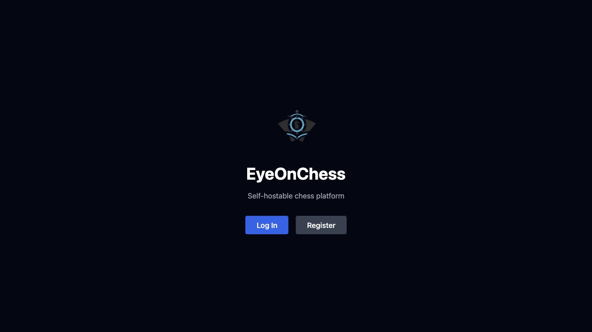
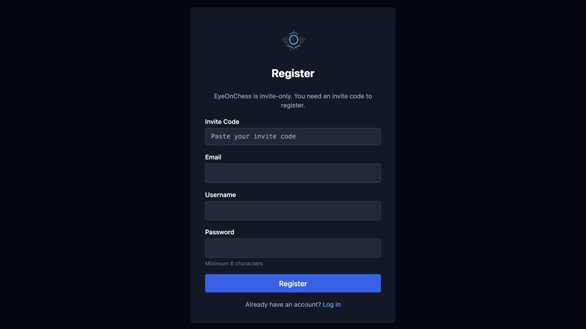
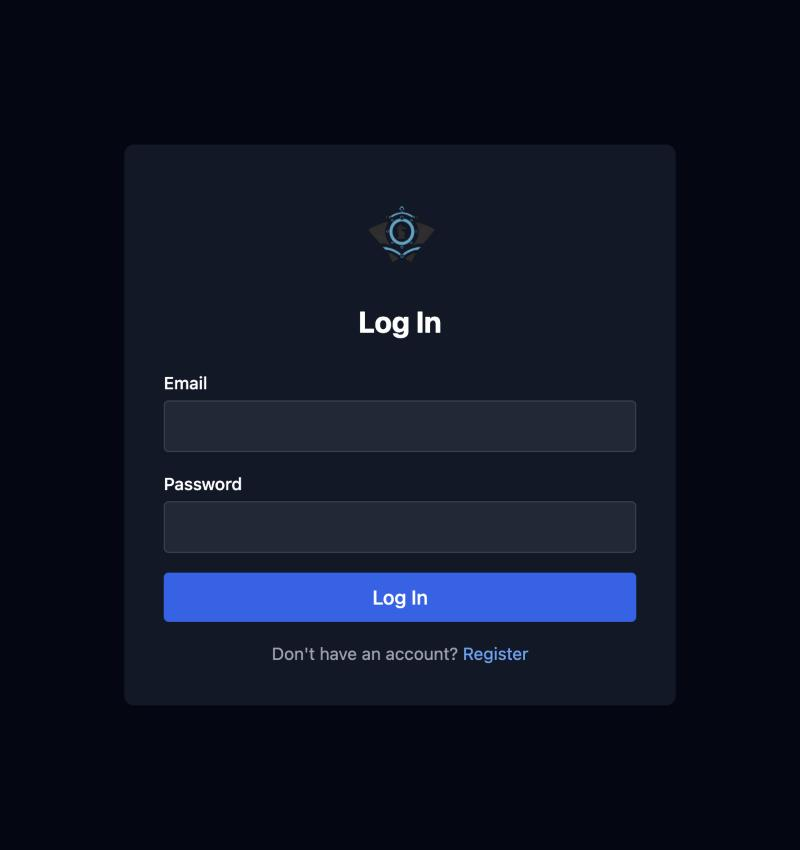
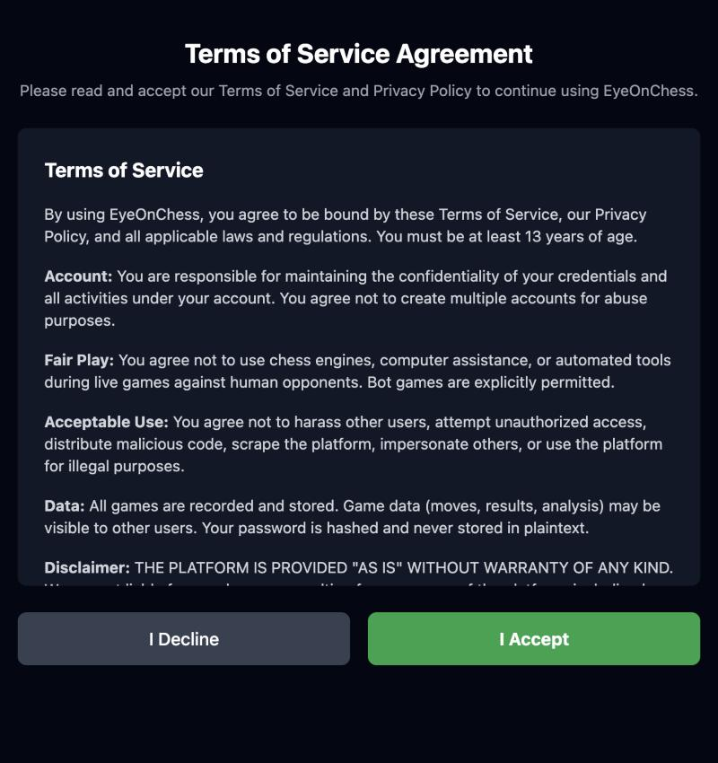
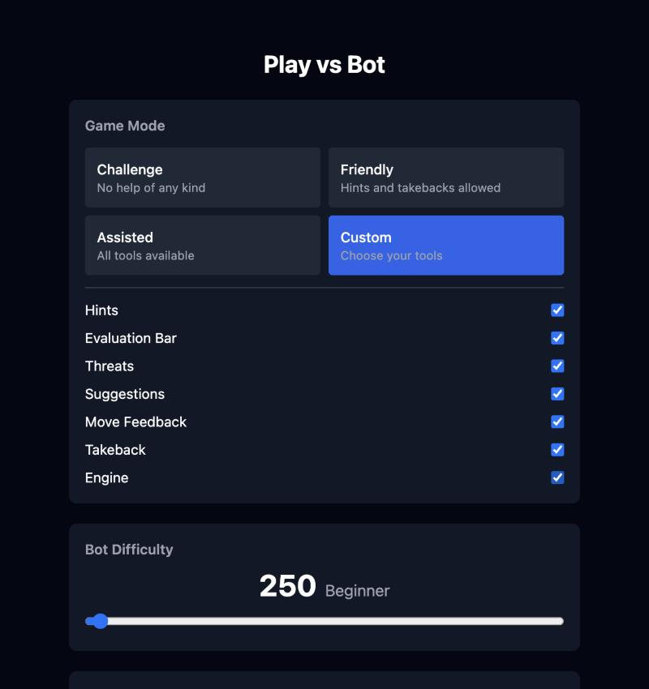
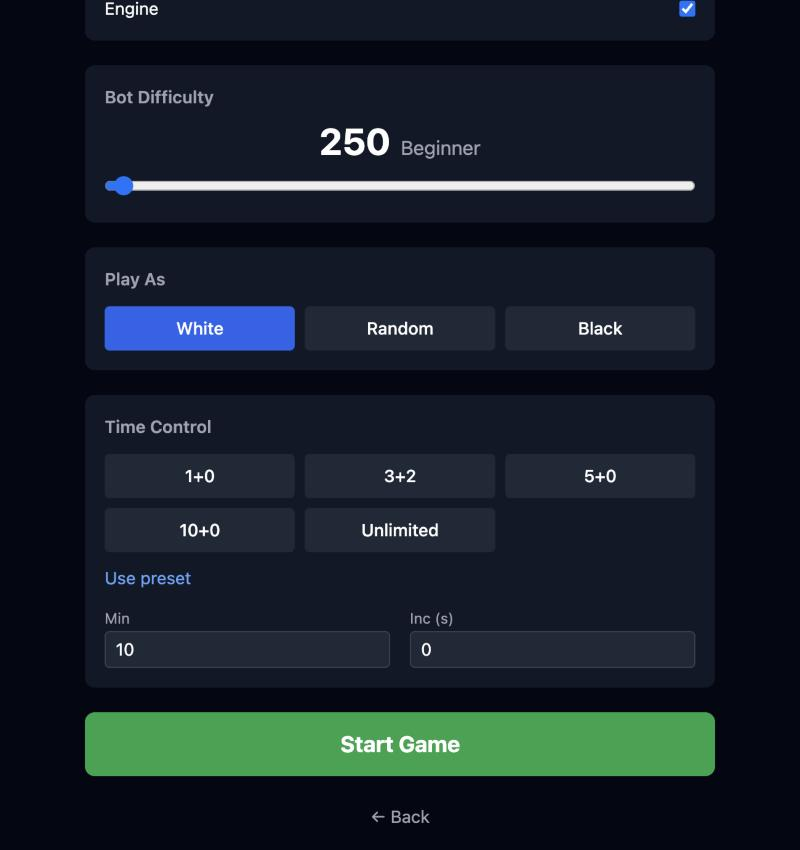
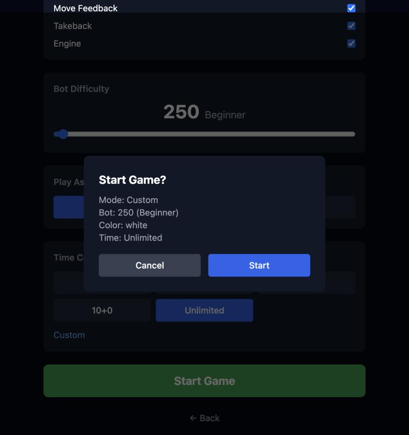
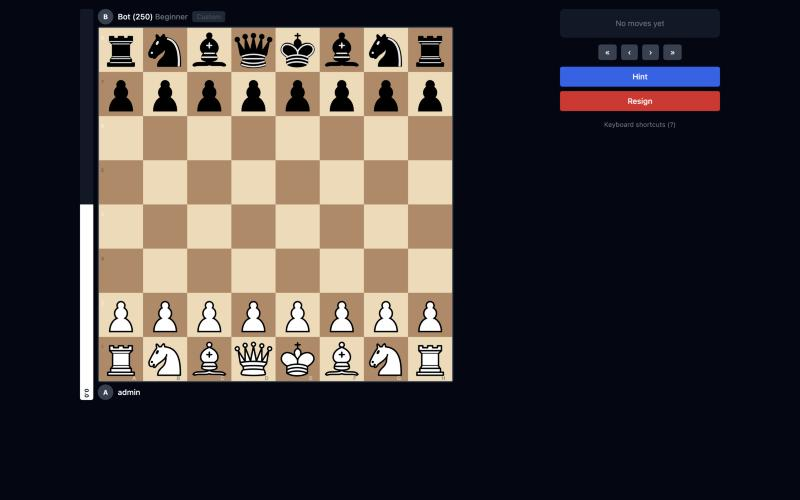
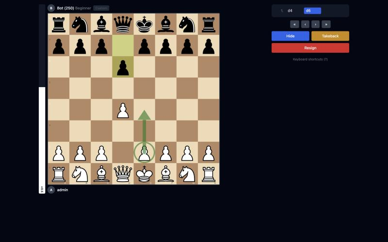
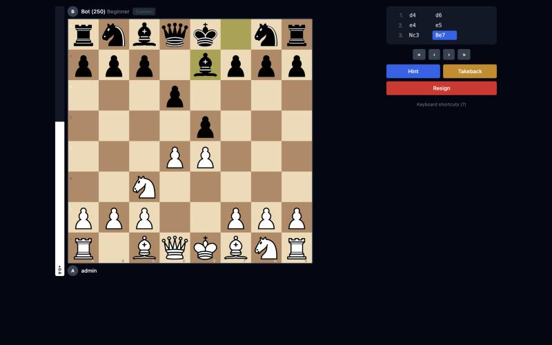

# Screenshots

Step-by-step walkthrough of the Eye on Chess user experience.

| #   | Screenshot                          | Description                                                                                                                                                            |
| --- | ----------------------------------- | ---------------------------------------------------------------------------------------------------------------------------------------------------------------------- |
| 1   |              | **Landing** — The home page shown to visitors with app branding and entry points to register or log in.                                                                |
| 2   |            | **Register** — New user registration form with username, email, and password fields.                                                                                   |
| 3   |                  | **Login** — Returning users sign in with their credentials.                                                                                                            |
| 4   |                      | **Terms of Service** — Users must accept the Terms of Service before accessing the app.                                                                                |
| 5   |      | **Play vs Bot** — Game setup screen with mode selection (Challenge, Friendly, Assisted, Custom), bot ELO slider, color choice, and time control.                       |
| 6   |  | **Play vs Bot (Custom tools)** — Custom mode selected with all tool toggles visible: Hints, Evaluation Bar, Threats, Suggestions, Move Feedback, Takeback, and Engine. |
| 7   |  | **Play vs Bot (Confirm)** — Confirmation dialog summarizing the game settings before starting the match.                                                               |
| 8   |        | **Game Start** — The board at the beginning of a game, showing the evaluation bar, move list panel, and available actions (Hint, Resign).                              |
| 9   |      | **Legal Moves** — A piece is selected on the board, highlighting all legal destination squares with dots.                                                              |
| 10  |                  | **Hints** — The hint feature draws an arrow on the board showing the engine's recommended move.                                                                        |
| 11  |            | **Gameplay** — A game in progress showing the board state, move history, evaluation bar, and all active Custom mode tools.                                             |
